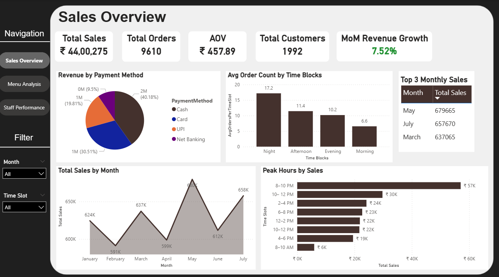

#Restaurant Analytics Dashboard – Sales & Performance Insights

-Designed and developed an end-to-end business intelligence dashboard to streamline sales and performance tracking.

-Extracted and transformed raw .asc data files into structured .csv format using Python for integration into Power BI.

-Modeled relational datasets using a star schema to optimize data relationships and improve DAX calculation efficiency.

-Built an interactive Power BI dashboard with in-page navigation, bookmarks, and buttons for a seamless user experience.

-Used DAX to calculate and visualize key business metrics such as top-selling items, peak sales hours, and customer trends.

-Delivered actionable insights that enabled data-driven inventory control and strategic decisions, reducing inventory costs by 30%.

