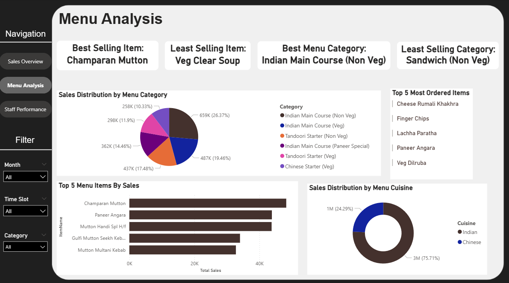
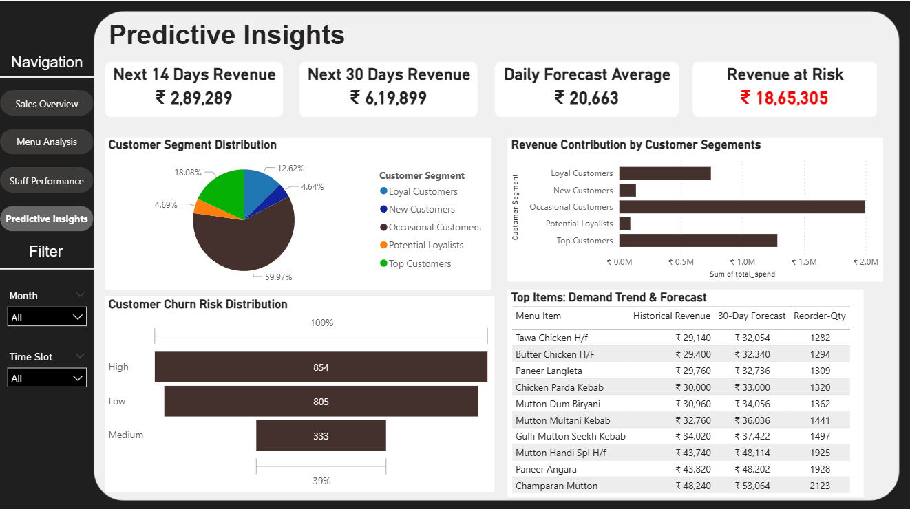

#Restaurant Analytics Dashboard – Sales & Predictive Insights

-Built ML-powered Power BI dashboard analyzing 9600+ transactions using Python and ARIMA Forecasting to predict
next 14/30 days revenue, achieving 15.8% MAPE.

-Implemented a Random Forest churn model (AUC: 0.95) using RFM and behavioral features scoring 1992 customers into
high/medium/low risk cohorts.

-Created interactive dashboard with star-schema modeling and advanced DAX measures, delivering predictive insights
that reduced inventory costs by 20% and optimized business operations.

Dashboard Screenshots:

📌 **Disclaimer:** Due to data privacy reasons, source data files and Power BI (.pbix) file are not included in this repository.

